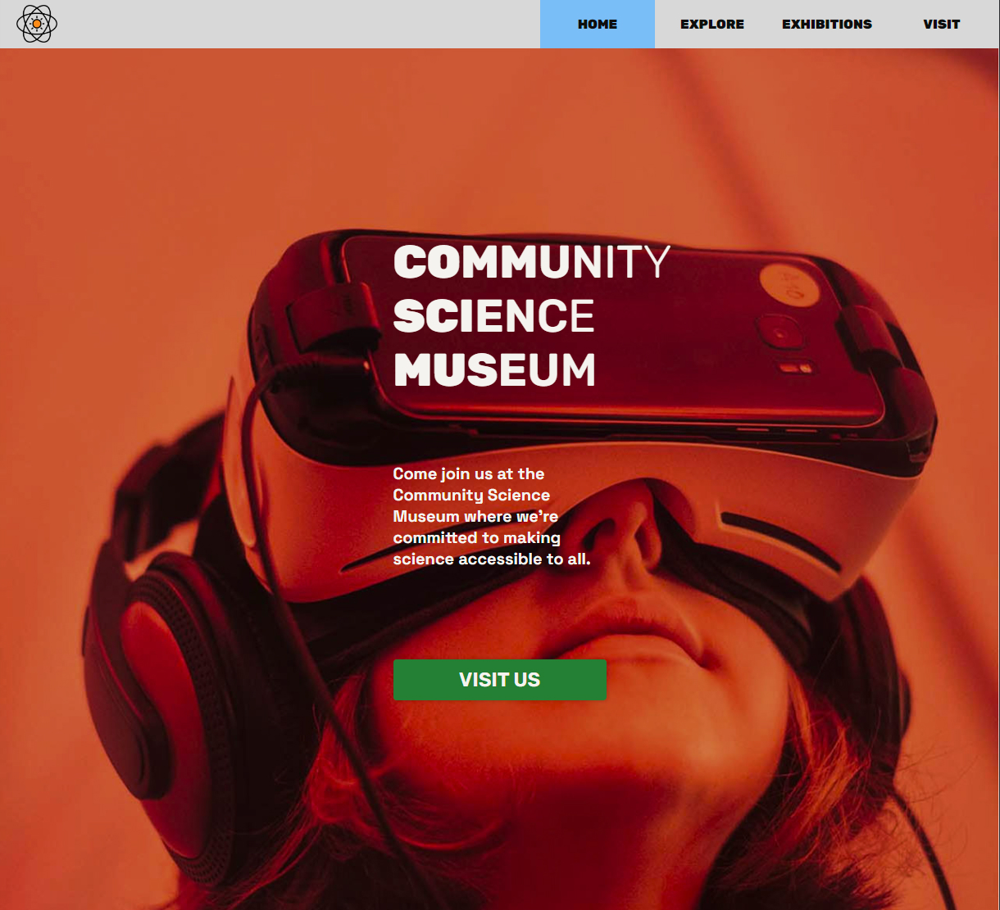

# GameOn Blog



A blog designated to gaming news, reviews and tutorials

## Description

Our first project exam. We were given a task to create a blog of our choosing using HTML, CSS and JS.
The content is stored on a WordPress rest API, and is displayed dynamically on the blog.
It is fully functional and more posts can be added with WordPress.

There are several JavaScript functions on the blog:
- Image carousel on the home page
- Modal to enlarge images on the specific-blog page
- Filtering on the articles page

The blog features several pages: 
- Home
- Articles
- Specific-article
- About
- Contact

## Built With

- HTML
- CSS
- JS
- Wordpress API

## Getting Started

### Installing

Clone the repo:

```bash
git clone https://github.com/ddyrnes/project-exam-1
```

## Contact

dev.dyrnes@gmail.com

[My LinkedIn page](https://www.linkedin.com/in/daniel-dyrnes-3a478a253/)
